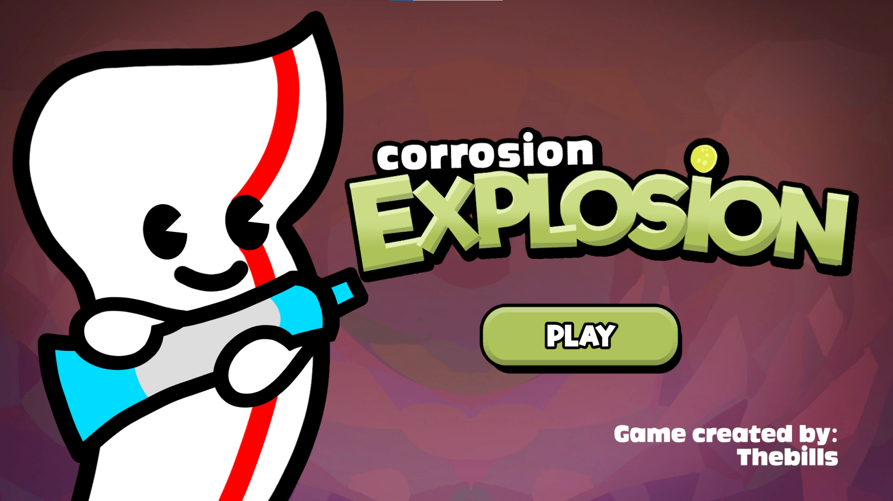

# MakeMeLaugh - Corrosion Explosion

"Corrosion Explosion" is an endless platformer(?) shooter where you try to survive for as many rounds as possible in the mouth of a foul goblin, a place swarming with dental decay bacteria. You play the role of the Little Tooth Paste, Pastek, who, with his handy weapons - a tooth paste and a tooth brush - tries to clean the place and kill all of the invaders. But look out - if too many teeth get corroded, the goblin will laugh at you and crush you under his fangs. Say cheese!

### Local setup

1. Go to https://globalgamejam.org/games/2024/corossion-explosion-5 and download zip file.
2. Unpack zip file
3. Run Corosion Explosion.exe
